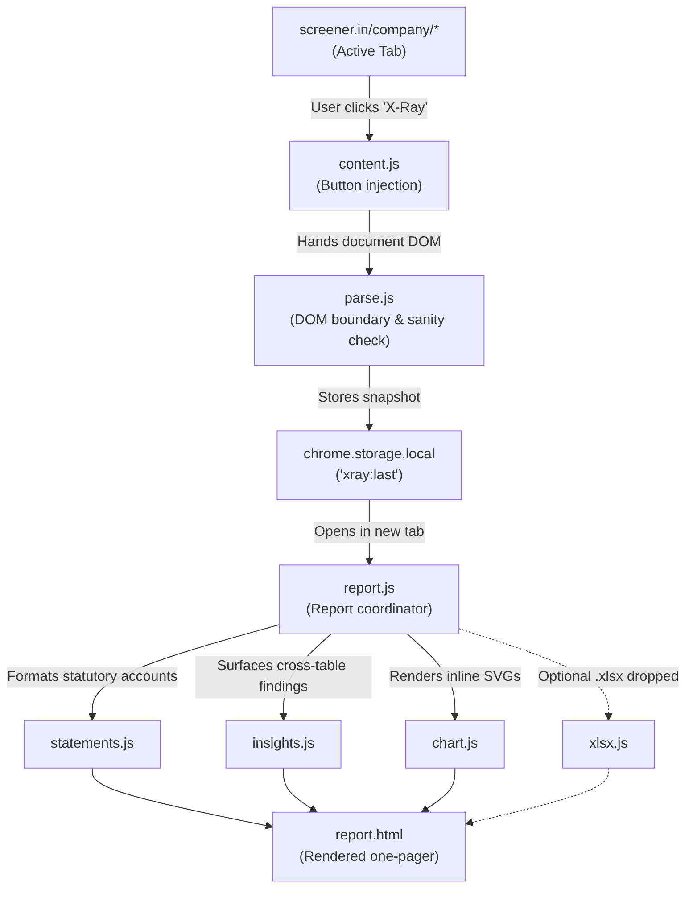

# Screener X-Ray

<strong>A local, descriptive one-pager for screener.in company pages — statutory Indian filing formats, adaptive SVG charts, and cross-statement findings right in your browser.</strong>

  
  
  
  

---

## What You Get

Screener X-Ray transforms raw, separate tables on screener.in into an integrated, printable research note:

- **Cross-statement X-Ray findings (`insights.js`)**: Surfaces relationships that Screener's individual tables only show one at a time. The engine evaluates 5-year cumulative cash from operations against profit after tax, compares other income against profit before tax, tracks borrowings against book equity, and watches capital work-in-progress relative to net block. Output is strictly factual and descriptive—stating figures and movements with no scores, star ratings, or buy/sell calls.
- **Statutory Indian filing arrangements (`statements.js`)**: Sets out condensed numbers into prescribed Indian reporting formats: Companies Act 2013 Schedule III Division II for corporates (assets first, then equity and liabilities), Banking Regulation Act 1949 Third Schedule (Form A & B) for banks, Division III for NBFCs, and Ind AS 7 for cash flows. A built-in toggle enables instant common-size analysis (% of revenue for P&L, % of total assets for Balance Sheet).
- **Adaptive 10-chart suite (`chart.js`)**: Hand-rolled inline SVGs drawn with zero external charting dependencies. The layout dynamically selects 10 charts tailored to the business model: banks receive asset quality (Gross vs. Net NPA) and funding mix (Deposits vs. Borrowings) instead of operating margins and inventory days; manufacturers receive working capital cycles and cash conversion.
- **Refusal of misleading metrics**: When derived math would distort financial reality, the engine actively refuses to emit a number. Negative book equity refuses return on equity and financial leverage (printing the negative equity that caused the refusal), non-positive cash flows refuse cash conversion, and missing data renders as "not reported", never as a misleading zero.
- **Private thesis notebook**: A persistent notes box saved in `chrome.storage.local` with timestamped entries per company, remaining entirely on your machine.
- **Optional local Excel integration (`xlsx.js`)**: Drag and drop Screener's downloaded `.xlsx` export into the report to unlock itemized expense lines (power & fuel, employee costs, raw materials) and asset breakdowns without uploading the spreadsheet.

---

## How It Works

All processing is synchronous, deterministic, and isolated to your browser:

---

> [!IMPORTANT]
> **Zero network calls · Zero telemetry · 100% on-device**  
> Screener X-Ray makes no external HTTP requests, contacts no analytics servers, and loads no remote scripts, stylesheets, or web fonts. Shipped extension permissions are strictly limited to `["storage"]`, a requirement enforced by the build tooling. Read the full [Privacy Policy](https://kaustubhbarve.github.io/Screener-Xray/).

---

## Sector-Specific Behavior

Screener X-Ray adapts its presentation and charts based on the company's reporting structure:

| Company Type | Example URL | Behavior |
|---|---|---|
| **Manufacturer** | `/company/ASIANPAINT/consolidated/` | Standard corporate layout; working-capital days; cash conversion; operating leverage scatter plot. |
| **Bank** | `/company/HDFCBANK/consolidated/` | Banking Regulation Act layout; "Financing Margin %" instead of OPM; asset quality (Gross/Net NPA) and funding mix; debtor/inventory days marked *not reported*. |
| **NBFC** | `/company/BAJFINANCE/consolidated/` | Schedule III Division III lending layout; financing profit structure; lender-like cash flow handling. |
| **Loss-Maker** | `/company/IDEA/consolidated/` | DuPont ROE and leverage refused due to negative book equity; negative net worth printed beneath. |
| **Insurance** | `/company/HDFCLIFE/consolidated/` | Standard layout despite financial classification, matching Screener's reporting format. |

---

## Getting Started

Screener X-Ray is not on the Chrome Web Store. You install it straight from this repository — no Node.js, no command line, no coding tools needed.

1. **Download it**:
   - At the top of this page, click the green **Code** button → **Download ZIP**.
   - Unzip the file. Windows' *Extract All* often creates a folder inside a folder (`Screener-Xray-main\Screener-Xray-main`) — the right one is the folder that contains `manifest.json`.

2. **Load it into Chrome**:
   - Open `chrome://extensions/` in Google Chrome.
   - Turn on **Developer mode** (toggle in the top-right corner).
   - Click **Load unpacked** and select the folder inside the main folder that has been extracted from the zip.

3. **Open a company report**:
   - Visit any consolidated company page on screener.in (e.g., `https://www.screener.in/company/ASIANPAINT/consolidated/`).
   - Click the **X-Ray** button beside the company name to open the report.

> [!NOTE]
> **Updates are manual.** When this repository changes, download the ZIP again, replace your folder, and click the reload arrow on the Screener X-Ray card in `chrome://extensions/`. Chrome may also show a notice about extensions running in developer mode — that is normal for anything installed outside the Chrome Web Store.

**For developers:** `node tools/package.js` builds a trimmed `dist/` folder containing only the shipped files, and refuses to build if a network call or extra permission has crept in. Load `dist/` instead of the whole repository if you prefer. For the step-by-step testing walkthrough, see [INSTALL.md](INSTALL.md).

---

## Quality Tooling & Verification

Because screener.in provides no public API, scraping logic is isolated strictly within `parse.js`. To guard against breaking site changes, the repository includes three verification tools:

- `node tools/package.js`: Validates the bundle against permission creep and network calls before generating `dist/`.
- `node --test`: Runs the unit test suite across saved fixtures to verify DOM parsing and calculation refusal rules.
- `npm run canary`: Fetches live screener.in pages and validates them against the selector contract in `parse.js`, catching markup changes before users encounter blank reports.

---

## Disclaimer

Figures are sourced directly from screener.in and are not independently verified. Screener X-Ray is not affiliated with, endorsed by, or connected to screener.in or its operators.

The reports generated are descriptive statistical summaries. They contain no scores, grades, ratings, price targets, or buy/sell/hold recommendations, and do not constitute investment advice. Verify all figures against statutory company filings before making investment decisions.

---

[Privacy Policy](https://kaustubhbarve.github.io/Screener-Xray/)
